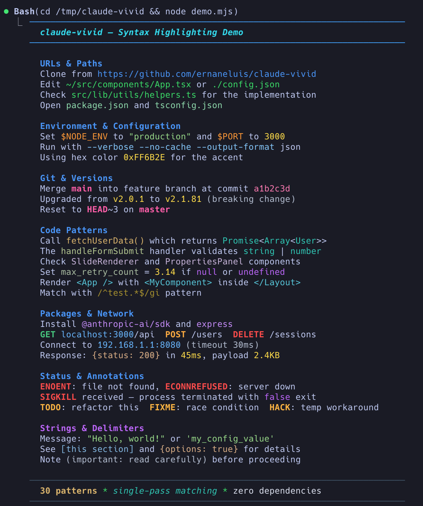

# claude-vivid

Rich syntax highlighting and vivid colors for Claude Code CLI output.

Transforms Claude Code's mostly-white terminal output into a colorful, readable experience with **30 regex-based highlighting patterns**, dark theme enhancements, and markdown renderer patches.

## Before / After

<table>
<tr><td>Before</td><td>After</td></tr>
<tr>
<td></td>
<td></td>
</tr>
</table>

## Install & Apply

```bash
# Clone and run — zero external dependencies
git clone https://github.com/ernaneluis/claude-vivid.git
cd claude-vivid
node claude-vivid.mjs --native
```

Then restart Claude Code.

## Usage

```bash
# Apply patches to native binary (recommended)
node claude-vivid.mjs --native

# Apply patches to npm installation
node claude-vivid.mjs --npm

# Restore original (undo all patches)
node claude-vivid.mjs --native --restore

# Run tests
npm test
```

## What it does

### 30 Output Highlighting Patterns

Automatically colors patterns in Claude's response text using a **single-pass matching algorithm** that prevents ANSI escape code corruption.

| # | Pattern | Color | Example |
|---|---------|-------|---------|
| 1 | URLs | blue underline | `https://github.com/...` |
| 2 | File paths (prefix) | bright green | `~/src/app.tsx`, `./index.js` |
| 3 | File paths (segments) | bright green | `src/components/App.tsx` |
| 4 | Env vars | orange | `$NODE_ENV`, `$HOME` |
| 5 | Hex numbers | yellow | `0xFF00AA` |
| 6 | CLI flags | light blue | `--verbose`, `--no-verify` |
| 7 | Git refs | pink bold | `main`, `master`, `HEAD` |
| 8 | Commit hashes | soft pink | `a1b2c3d` |
| 9 | Function calls | warm gold | `fetchData()` |
| 10 | Packages | light purple | `express`, `@anthropic-ai/sdk` |
| 11 | Versions | yellow | `v2.1.81`, `^4.0.0` |
| 12 | Localhost/IPs | soft blue | `localhost:3000` |
| 13 | Filenames | mint green | `index.js`, `config.yaml` |
| 14 | Error codes | red bold | `ENOENT`, `SIGKILL` |
| 15 | HTTP methods | color-coded bold | GET=green, POST=orange, DELETE=red |
| 16 | Booleans/nulls | purple | `true`, `false`, `null` |
| 17 | Type names | teal | `string`, `Array`, `Promise` |
| 18 | Durations/sizes | yellow | `30ms`, `4KB`, `500MB` |
| 19 | Regex patterns | dim yellow | `/^test.*$/gi` |
| 20 | "Double quoted" | soft green | `"hello world"` |
| 21 | 'Single quoted' | soft green | `'my_value'` |
| 22 | (Parenthesized) | silver | `(important note)` |
| 23 | [Bracketed] | light blue | `[this section]` |
| 24 | {Curly braced} | warm tan | `{status: ok}` |
| 25 | JSX Components | aqua | `<App />`, `<MyComponent>` |
| 26 | camelCase | sage | `fetchUserData` |
| 27 | snake_case | muted green | `my_variable` |
| 28 | PascalCase | lavender | `SlideRenderer` |
| 29 | TODO/FIXME/etc | amber bold | `TODO`, `FIXME`, `HACK` |
| 30 | Decimals | yellow | `3.14`, `99.99` |

### Markdown Renderer Enhancements

- **H1 headings**: vivid cyan + bold italic underline
- **H2 headings**: bright blue + bold
- **H3+ headings**: vivid purple + bold
- **Bold text**: warm gold
- **Italic text**: vivid teal
- **List bullets**: bright green
- **Blockquotes**: vivid teal bar
- **Horizontal rules**: unicode line
- **Links**: vivid blue + underline (always colored)

### Dark Theme Overrides

- High-contrast text colors
- Vivid prompt borders
- Distinct user/AI message backgrounds
- Saturated success/error/warning colors
- Bright subagent colors

### Input Box Highlighting

- File paths, URLs, env vars, flags, git refs
- Slash commands, backtick code, quoted strings
- Numbers and hex values

## How it works

1. **Unpacks** Claude Code native binary JS (built-in Bun SEA parser)
2. **Discovers** all theme objects by regex and overrides dark mode colors
3. **Patches** the markdown renderer (`mD()` function) for headings, bold, italic, links, etc.
4. **Injects** `_CC_()` — a colorizer function that runs all 30 regex patterns in a **single pass**
5. **Wraps** the `text` and `codespan` token handlers to call `_CC_()`
6. **Repacks** into the native binary

### Why single-pass?

A naive sequential approach (apply pattern 1, then pattern 2, etc.) corrupts output because later patterns match inside ANSI escape codes injected by earlier patterns. For example, `\x1b[38;2;40;220;90m` contains `90m` which the duration pattern would match as "90 minutes".

The single-pass algorithm:
1. Runs all 30 regex patterns against the **original clean text**
2. Collects non-overlapping matches (earlier patterns have priority)
3. Applies all ANSI color codes at once, from right to left

## Testing

```bash
npm test
```

Runs 67+ test cases covering:
- Every pattern (positive and negative matches)
- Overlap resolution (URLs vs paths, etc.)
- ANSI escape code immunity

## Compatibility

- Claude Code v2.1.x (native binary or npm)
- Node.js 18+
- macOS, Linux (Windows untested)
- Zero external dependencies

## License

MIT
